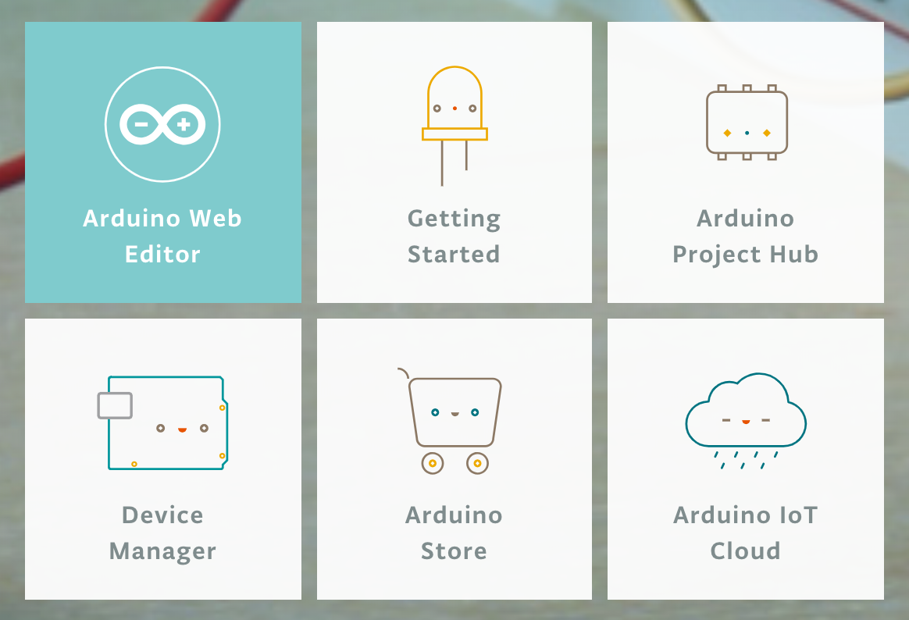
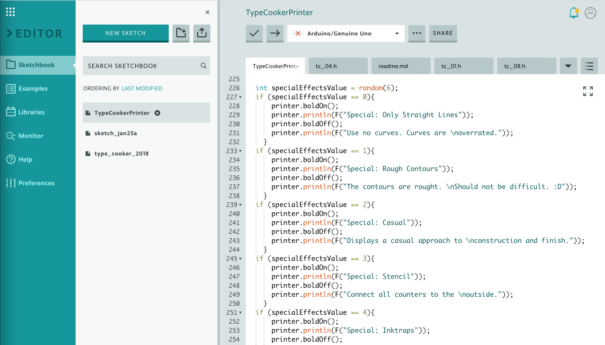
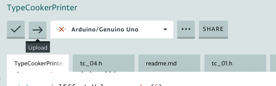
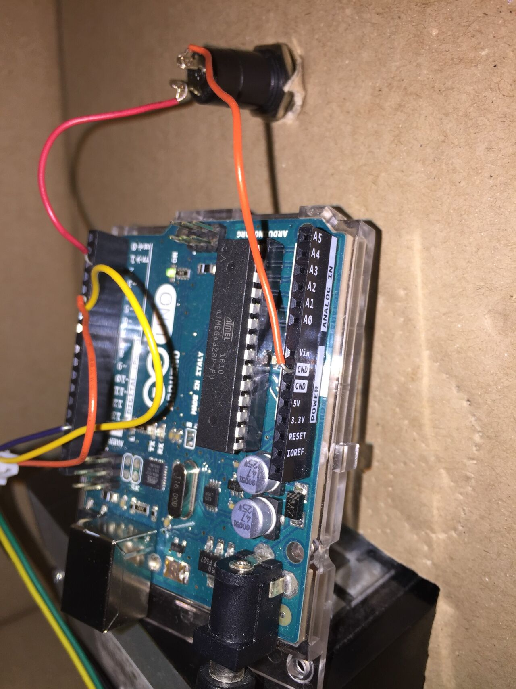
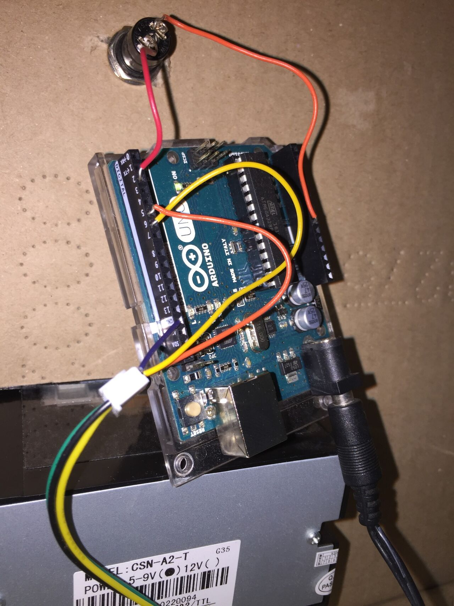

# Arduino + Thermal Printer + Button

Originally made by Thom Janssen & Sven Fuchs for Open Day Type]Media 2017.

Updated in January 2018 by Stephen Nixon.

---

# Arduino – editing code on Type Cooker machine

# Basics

Arduino has a web editor environment. You need to sign up for a user account to use it, but once you do, you can plug an arduino into your computer via USB, and interact with it.

https://create.arduino.cc/

Getting started docs: https://create.arduino.cc/projecthub/Arduino_Genuino/getting-started-with-arduino-web-editor-on-various-platforms-4b3e4a

## Editing code
### Q: Can I read what’s currently on the Arduino?
> Is there any way to get the code from the arduino to the computer?
> I don't have the code anymore that is on the arduino and I need to change it.
> Please help

Reply:

> The short answer is no  :(
> 
> I'm sure that there is a way to get the code off of the Arduino, but it wouldn't be what you expect, it would be assembly code. Unfortunately it would be faster to rewrite from scratch.

https://forum.arduino.cc/index.php?topic=3566.0

**Q: Can I put multiple programs onto an Arduino, without erasing what’s currently on there?**
I was worried about erasing anything on the board, because I wasn’t sure if the code downloaded from Thom’s github might break for some reason. I didn’t really need to worry; the code was fine, and nothing broke.

That is to say, don’t worry about overwriting what is there. If you need the original code, it is \[available from Thom Jannsen’s GitHub\](https://github.com/thomgb/ArduinoStuff). However, it is worth using this code instead, as it has been corrected and extended slightly, with more typecooker cases.

### Editing the code

Go to https://create.arduino.cc/, make a login ID, and then go to Arduino Web Editor

Make sure you’ve linked the board to the browser:

https://create.arduino.cc/projecthub/Arduino_Genuino/getting-started-with-arduino-web-editor-on-various-platforms-4b3e4a#toc-make-your-board-blink-from-the-browser-6

Edit it in the Arduino Create web IDE:

To update the year, simply change this line (currently line 72):

    printer.println(F("TypeCooker @ Open Day 2018"));

To edit or change the recipe, update the text in the `if` statements

When the Arduino is connected via USB, it’ll show up in the dropdown at top. When you’ve edited the code, just click the right arrow to upload it onto the arduino.

You can even test the functions on the arduino while it’s still hooked up to USB, so it’s pretty quick and easy to test.

## Wiring instructions. Be sure to keep it connected, or it will stop working!

Put in another way:

The button has two connections:
*RED* to _Digital 2_
*ORANGE* to _Power GND_

The receipt printer connects to:
*BLUE* to _GND_ (on the logo side of the Arduino Uno board)
*ORANGE* to the _Digital 5_
*YELLOW* to the _Digital 6_

## Editing the images?

I didn't edit the images on the printer, but it should be doable if you are interested. The files `tx_0*.h` hold the image information.

When asked, Thom Jannsen said, "I think we some tiff2bitmap converter for the images but i'm not sure... please play around with everything," and "search for terminal printer arduino images bitmap."

## That's basically it!

This guide is brief, but feel free to edit & extend it if you learn more useful information. With a bit of programming knowledge of Python, I found that the Arduino code was fairly straightforward.

Feel free to reach out if you have any questions!
